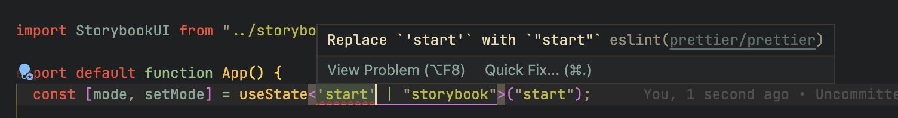

# 🏦 Project Croatia: Mobile App
For any questions please reach out to [me](mailto:rpander@deloitte.nl)! This README is a Work In Progress(tm) document, so not much to see here yet. Please come back regularly too see exciting content!

## Getting Started
We use `yarn` to manage dependencies on this project. Start by running `yarn install` in the root of the project to install dependencies. Then run `npx pod-install` to install iOS Pods.

Please verify that your editor is configured correctly to use `ESLint` when saving a file. You can do this by writing some code and seeing if your editor provides hints:

If it does? Great! Now save te file and see if the editor automatically formatted the document and the hint disappeared.

If any of this doesnt work? Sad 😰 Go on the Internet and fix it!

## Development Workflow
We aim to use [Trunk-Based Development](https://trunkbaseddevelopment.com/) to steer our day-to-day workflow. In short, there's one main branch (the "trunk") from which branches are created to work on pieces of work. These branches should be short-lived to minimize possible merge conflicts. Heavy use of automated tooling is required to catch bugs early.

### Creating a Branch
When picking up a new piece of work from the backlog, start by branching off the trunk branch ("main"). To ensure some consistency between naming of branches, please adhere to the following format for a branch name:

>> type/ticket#-whatever-you-want

So, for example `feat/2023948-upgrade-react-native-v070` would be an example of a properly named branch. Please read the section *Committing* to read other examples of what `type` could be.

### Committing
We implemented [Commitlint](https://github.com/conventional-changelog/commitlint) to ensure consistency between commit messages. This allows us to automatically extract changelogs from Git metadata. Formatting of commit messages is enforced through Git Hooks. A commit message should have the following format:

>> type(scope?): subject # scope is optional, multiple scopes are supported (delimited by a ",")

... where common types are: `build`, `chore`, `docs`, `feat`, `fix`, `refactor`, `test` and scope generally refers to a JIRA ticket.

## Creating a Pull Request
When satisfied with your changes, create a Pull Request from your branch and assign it to 1 or more reviewers. Choose a reviewer based on who else (recently) worked on the piece of code that you edited. Please name your Pull Request according to the Commitlint standard:

>> type(scope?): subject # scope is optional, multiple scopes are supported (delimited by a ",")

### Merging
Merging a Pull Request is only allowed after a minimum of 1 review by a peer developer. All tests and checks **MUST** pass! Whoever will not adhere to this rule will have to bring cookies.

Pull Requests will be merged using the *squash merge* strategy to create a nice and linear history.
